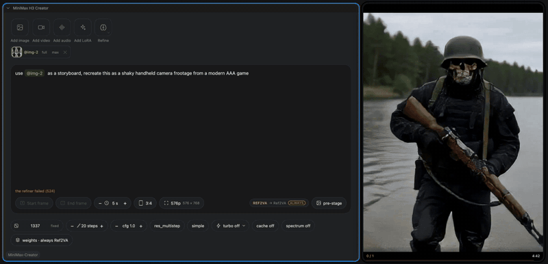
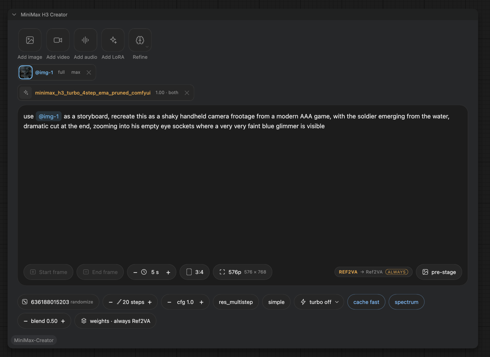
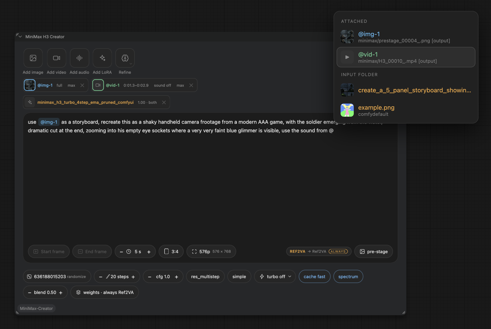
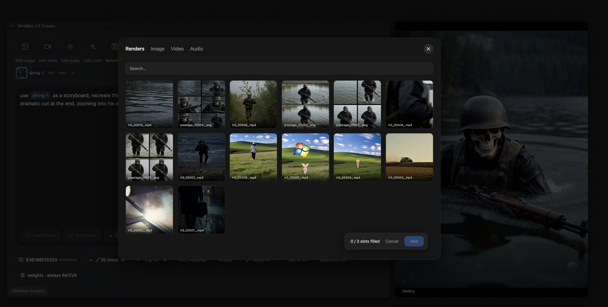
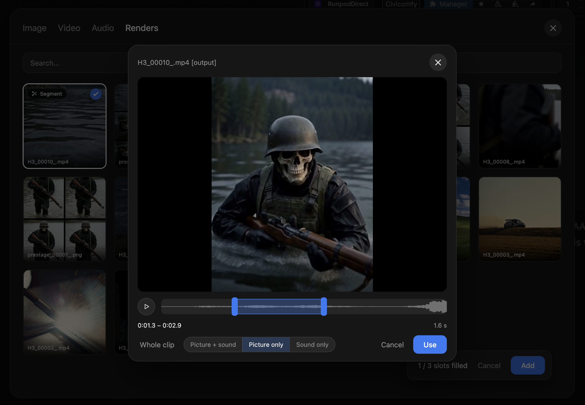
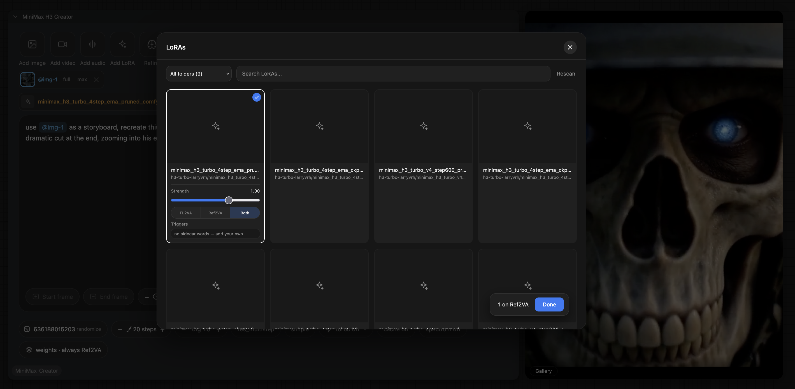
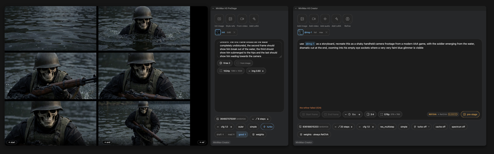
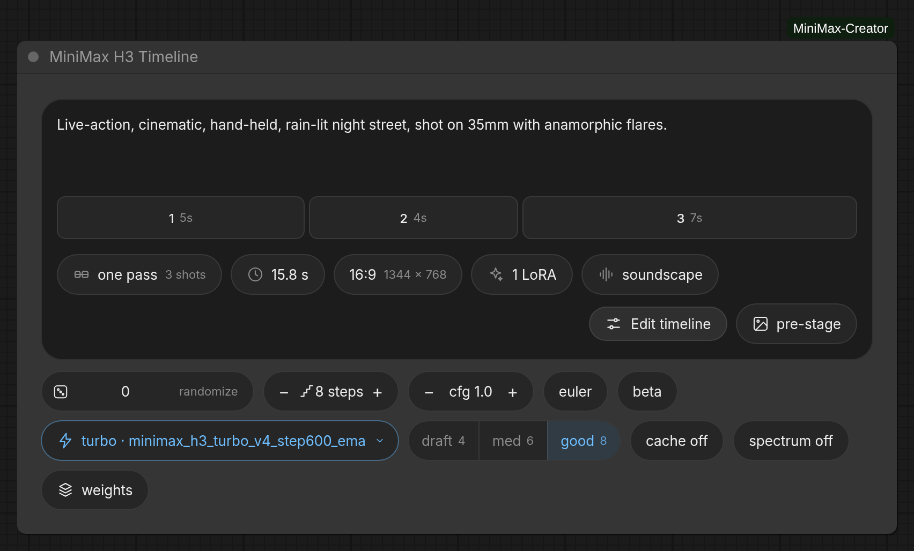
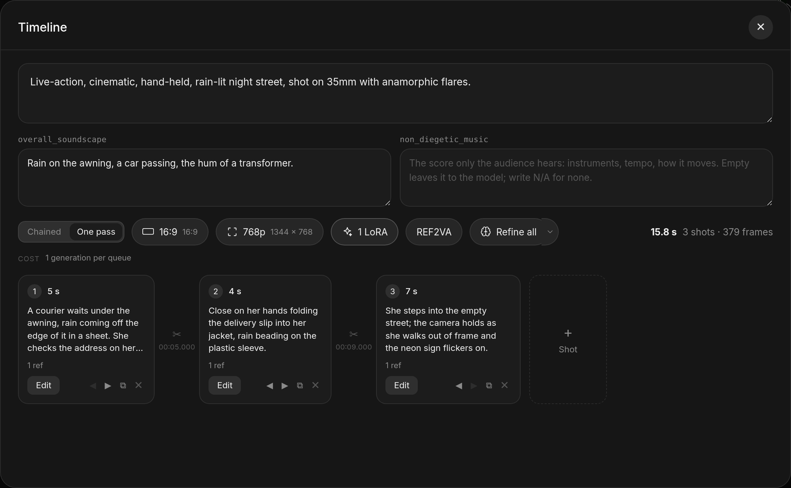

# MiniMax H3 Creator

Write a sentence, attach your media with `@`, press Run. One node holds the whole
generation and hands back a finished clip with its sound already in it — no
conditioning sockets, no sampler to re-assemble, no VAE to remember to connect.

Local open weights only, through core's `comfy_extras/nodes_minimax_h3.py`. No API
key, nothing uploaded.



## The node



Everything is on it. The rail at the top attaches images, video, audio and LoRAs;
the box in the middle is your prompt; the pills at the bottom are duration, aspect,
resolution and the sampler. The badge on the right (`REF2VA → Ref2VA`) tells you
which checkpoint this render will land on.

That is the whole workflow. Drop the node, type, run.

## Install

```
cd ComfyUI/custom_nodes
git clone https://github.com/roadmaus/comfyui-minimax-creator ComfyUI-MiniMax-Creator
```

Restart ComfyUI. Nothing to `pip install`. You need a ComfyUI new enough to ship
`comfy_extras/nodes_minimax_h3.py`, since that is where the model lives.

Then put the weights where ComfyUI already looks:

| file | folder |
|---|---|
| FL2VA, Ref2VA | `models/diffusion_models` |
| text encoder | `models/text_encoders` (CLIPLoader type `minimax`) |
| video VAE, audio VAE | `models/vae` |
| preview decoder | `models/vae_approx` — [`taeh3.safetensors`](https://github.com/madebyollin/taehv) |
| refiner (optional) | `models/text_encoders` — any Qwen3-VL, 4B is plenty |
| Krea 2 / Ideogram 4.0 (optional) | `models/diffusion_models`, `models/text_encoders`, `models/vae` |

You pick the files in the node itself, on the **weights** pill. Anything a render
needs and does not have is refused before the queue starts, naming the field and
the folder it looks in.

## Attaching things

Type `@` anywhere in the prompt. The menu lists what is already attached first, then
everything in your input folder — pick a file that is not attached yet and it gets
attached.



The rail buttons open the same library with a tab per kind, search, shelves,
favourites and upload. The **Renders** tab browses `output/`, so a clip you just
made can go straight back in as a reference.



**Gallery** on the rail opens straight onto that tab. It is the same picker, so
renders organize exactly like input files do: make a shelf, drag thumbnails onto
it, star the keepers, and use **Organize** to move or delete in bulk. Stills and
finished clips arrive on separate shelves, because the two nodes write to
separate folders — see below.

Every attachment gets a colour and its chip in the sentence wears the same one, so
you can match a reference in the prose to a picture without reading.

Why this matters: H3 does not take free text. It takes a structured description
where every reference is addressed as `<Picture 1>`, `<Video 2>`, `<Audio 1>`.
Writing `use @img-1 for her face` assigns those labels for you, in the exact order
the tokenizer expects.

### Trimming

Video and audio get a segment editor — on the picker cell or on the attached chip.
Scrub, drag the handles, or slide a fixed-length selection along the clip. The range
sits on the waveform, decoded in the browser, so you can see where the sound is
before you cut it.



The three buttons underneath decide what a video reference contributes: **picture +
sound** brings its soundtrack in as a reference audio too, **picture only**
references it silently, and **sound only** throws the picture away — which is what
you want for a voice, a room tone, or scoring that happens to live in an mp4.

Reference *images* get a scope dial instead: `full · person · object · scene ·
style`. On `person`, "her from @img-1" stops dragging that image's background,
palette and pose along with the face.

## LoRAs



A full-screen manager over `models/loras`. Cards carry the showcase image, Civitai
title, base model and trigger words read from the CiviMeta sidecar; a LoRA without
one still gets a working card from its filename. Each card sets a strength, which
checkpoint it belongs to, and its trigger words. Those words are prefixed to the
prompt at compile time and printed under the LoRA chips in the node body.

**turbo** on the sampler row is a switch, not a preset: it adds a distillation LoRA
(larryvrh's `minimax_h3_turbo_v4_step600_ema`, the lightx2v 4-step distill, or
Kijai's conversions), moves the sampler to euler + beta, and drops the steps to
4 / 6 / 8. Switching it off puts all of it back.

## Refine

`Refine` rewrites your sentence into the long, sectioned description H3 was actually
trained to read, using a small local vision model. The result lands in an editable
box under the prompt — correct it, switch it off without losing it, or revert.

It looks at your attached images, writes real dialogue lines instead of "she says
something", always writes a soundscape, keeps quoted words exactly, and picks how
many shots the clip holds and the second each one starts on.

It is a button rather than a queue-time step on purpose: you should see what the
model will read *before* five minutes of sampling, not infer it from the result.

## PreStage



The pipeline eats stills — start frames, end frames, references, storyboards — and
making one usually means a second workflow, a second tab and a trip through the
output folder. The PreStage generates them on the same canvas, locally, with Krea 2
or Ideogram 4.0.

Spawn it from the **pre-stage** pill; it lands at the left edge of the node it
belongs to. Its result card has chips that write the finished still straight into
the peer as a start frame, end frame or reference. The hand-off is by file, so one
Run does both and an untouched PreStage is a cache hit.

## Timeline

A second node for a clip made of several shots. Each card is a whole generation —
its own prompt, references and LoRAs, edited in the same editor the Creator uses.



The lane in the node body is strictly proportional to the durations. The strip
inside the modal is where the work happens.



**Chained** renders each segment and joins them; a segment can start from the
previous one's last frame and inherit a tail of its sound. **One pass** compiles the
same cards into a *single* generation, since H3's prompt format is already a shot
list — nothing is decoded and re-encoded mid-clip, so there is no seam and music or
dialogue carries across a cut. **Refine all** rewrites every card in one call, which
is the only way a later shot keeps the look an earlier one established.

## Modes and duration

What you attach picks the mode, and the mode picks the checkpoint — only that one is
loaded:

| attached | mode | checkpoint |
|---|---|---|
| nothing | T2VA | FL2VA |
| start and/or end frame | I2VA / L2VA / FL2VA | FL2VA |
| any reference image/video/audio | REF2VA | Ref2VA |

Frames and references cannot be combined. Clicking the mode badge forces everything
onto one checkpoint instead, which is worth it because Ref2VA handles text and
keyframes fine and one checkpoint can then cover a whole timeline.

Frame counts must satisfy `n % 17 == 5` at 24 fps, so there is no 6.00-second H3
video. The pill shows whole seconds and the compiler lands on the nearest legal
count:

| shown | 5 | 6 | 7 | 8 | 9 | 10 | 12 | 15 |
|---|---|---|---|---|---|---|---|---|
| frames | 124 | 141 | 175 | 192 | 209 | 243 | 294 | 362 |
| real | 5.17 | 5.88 | 7.29 | 8.00 | 8.71 | 10.13 | 12.25 | 15.08 |

The resolution slider sets the **short edge** (384–896, native 768); both axes snap
to 32. In the image modes the aspect comes from the keyframe.

## Where files go

Renders are saved by the node itself, under ComfyUI's output folder. The **folder
pill** on the Creator, the Timeline and the PreStage sets where — click it and
type a path:

| | default | lands in |
|---|---|---|
| Creator / Timeline | `minimax/renders/H3` | `output/minimax/renders/H3_00001_.mp4` |
| PreStage | `minimax/stills/prestage` | `output/minimax/stills/prestage_00001_.png` |

The last segment names the **files**, not a folder: `client-a/hero` writes
`hero_00001_.mp4` into `output/client-a/`. Ending with a slash keeps the default
filename, so `client-a/` is usually what you want.

`%year%`, `%month%`, `%day%`, `%hour%`, `%minute%`, `%second%`, `%width%` and
`%height%` are filled in as each file is written, in a folder as readily as in a
filename — `minimax/%year%-%month%-%day%/H3` gives you a folder per day. The
popover has a button per token and shows the exact path the next file will take.

The value is saved in the workflow, so a `.json` shared with someone else renders
into the same structure on their machine.

### Moving the input and output folders themselves

The pill is relative to ComfyUI's output folder and cannot climb out of it. To
move the folders themselves, use ComfyUI's own flags — this pack reads every path
through `folder_paths`, so they work here with nothing to configure:

```bash
python main.py --input-directory /Volumes/Media/comfy-in \
               --output-directory /Volumes/Media/comfy-out
# or --base-directory to move input, output, temp, user and models together
```

Two things worth knowing:

- `extra_model_paths.yaml` **cannot** do this. It only adds model search paths;
  input and output are not model folders.
- **Symlinking a folder into `input/` does not work**, and the picker will not
  list files that resolve outside the folder they appear in. ComfyUI resolves
  symlinks before checking that a path stays inside the input directory, and that
  check is what stops a crafted filename reaching the rest of your disk — so it is
  not something this pack works around. Use `--input-directory` instead.

## Thanks

This pack is glue. The work underneath it belongs to other people:

- **[Comfy Org](https://github.com/comfyanonymous/ComfyUI)** — H3 lives in core;
  this node only drives it.
- **[ComfyUI-Spectrum-MiniMax-H3](https://github.com/xmarre/ComfyUI-Spectrum-MiniMax-H3)**
  by xmarre and
  **[ComfyUI-MiniMaxH3-FirstBlockCache](https://github.com/duckyshell/ComfyUI-MiniMaxH3-FirstBlockCache)**
  by duckyshell — the two accelerator pills on the sampler row.
- **[ComfyUI-KJNodes](https://github.com/kijai/ComfyUI-KJNodes)** by Kijai — gives the
  live preview a real decoder. Kijai's turbo conversions are in the switch too.
- **[ComfyUI-MultiGPU](https://github.com/pollockjj/ComfyUI-MultiGPU)** by pollockjj —
  puts a device chip on every row of the weights popover.
- **[taehv](https://github.com/madebyollin/taehv)** by madebyollin — the tiny decoder
  that makes the preview look like the video.
- **larryvrh** and **lightx2v** — the H3 distillation LoRAs behind turbo.
- **CiviMeta** — the sidecar format the LoRA cards read.

All four packs are optional and none of them is required. If they are installed, the
matching pills light up.

## Tests

```
python3 tests/test_compile.py         # canvas math, modes, limits, ordering
python3 tests/test_refine.py
python3 tests/test_outputs.py         # what an output prefix may be
python3 tests/test_canvas_mirror.py   # canvas.js against canvas.py
python3 tests/test_prestage_mirror.py
python3 tests/test_outputs_mirror.py  # outputs.js against outputs.py
```

Those need neither torch nor ComfyUI (the mirror tests need `node`). The graph tests do, and skip themselves with a
message when it is not importable:

```
COMFYUI_PATH=~/ComfyUI <comfy-venv>/bin/python3 tests/test_creator_graph.py
```

Set `COMFYUI_BASE` as well when `--base-directory` points somewhere else — on a
Desktop install the running tree and the folder holding `custom_nodes`, `models` and
`output` are usually two different places.

The design decisions, in full, are in [PLAN.md](PLAN.md).

## License

[MIT](LICENSE). ComfyUI itself is GPL-3.0 and this pack imports it; if you
redistribute the two together rather than as a node pack people install themselves,
that combination is what the GPL has an opinion about.
