# MiniMax H3 Creator

Three ComfyUI nodes for MiniMax H3, built around one idea: you write a sentence,
you attach media with `@`, and you press queue. No conditioning sockets, no
sampler to re-assemble, no VAE to remember to connect. The node holds the whole
generation and hands back a muxed clip with its sound already in it.

It targets the **local open weights** through core's
`comfy_extras/nodes_minimax_h3.py`. No API key, nothing uploaded.

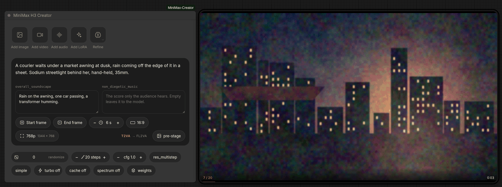

## Why one node

H3 does not take free text. It takes a structured Context-IR in which every
reference is addressed by an ordinal label — `<Picture 1>`, `<Video 2>`,
`<Audio 1>` — and the reference form has six mandatory sections. Producing those
labels by hand, in the order the tokenizer presents them, is the actual
difficulty of using the model.

The `@` mention is the fix. You attach a picture and write `use @img-2 for her
face`, and the labels are assigned and substituted for you. Everything else here
exists to support that one gesture.

It also does not take *short* text. H3-Base was trained on the output of a hosted
rewriter that turns a sentence into a page of sectioned description, and the
Refine button is a local stand-in for it.

## The three nodes

| | |
|---|---|
| **MiniMax H3 Creator** | One generation. One prompt, its references, its LoRAs, its sampler. |
| **MiniMax H3 Timeline** | A strip of cards, each one a whole generation's worth of settings, rendered as separate clips joined end to end or as a single multi-shot generation. |
| **MiniMax H3 PreStage** | The still-image node the other two feed on: keyframes, references and style sheets, generated locally with Krea 2 or Ideogram 4.0. |

The Timeline also registers a handful of internal nodes (segment, join, last
frame, audio tail, save) that the subgraphs are built out of. You never place
those yourself.

## Install

```
cd ComfyUI/custom_nodes
git clone https://github.com/roadmaus/comfyui-minimax-creator ComfyUI-MiniMax-Creator
```

Restart ComfyUI. There is nothing to `pip install` — the pack has no dependencies
of its own beyond what ComfyUI already has. You do need a ComfyUI new enough to
ship `comfy_extras/nodes_minimax_h3.py`, since that is where the model lives.

Then put the weights where ComfyUI already looks:

| field | folder |
|---|---|
| FL2VA, Ref2VA | `models/diffusion_models` |
| text encoder | `models/text_encoders` (loaded as CLIPLoader type `minimax`) |
| video VAE, audio VAE | `models/vae` |
| preview decoder | `models/vae_approx` — [`taeh3.safetensors`](https://github.com/madebyollin/taehv) |
| refiner (optional) | `models/text_encoders` — any Qwen3-VL |
| Krea 2 / Ideogram 4.0 (optional) | `models/diffusion_models`, `models/text_encoders`, `models/vae` |

Files are picked in the node itself, on the **weights** pill at the end of the
sampler row. Anything a render actually needs and does not have is refused before
the queue starts, naming the field and the folder it looks in.

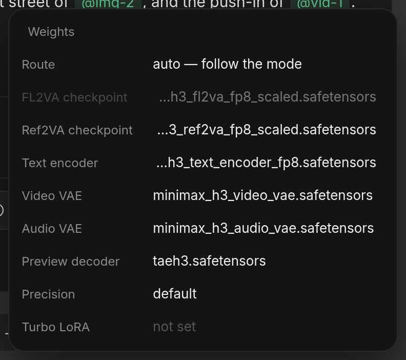

Four community packs are used if they are installed and never required:
[MultiGPU](https://github.com/pollockjj/ComfyUI-MultiGPU) puts a device chip on
every row of that popover, [KJNodes](https://github.com/kijai/ComfyUI-KJNodes)
gives the live preview a real decoder, and
`ComfyUI-MiniMaxH3-FirstBlockCache` and `ComfyUI-Spectrum-MiniMax-H3` are the two
accelerator pills on the sampler row.

## Attaching things

The rail's first three buttons open the picker over your input folder. It has a
tab per kind, a search box, shelves you can file things into, favourites, upload,
and a **Renders** tab that browses `output/` so a finished clip can be picked
straight back in as a reference. The counter in the corner knows the model's
limits and stops you before the queue does.

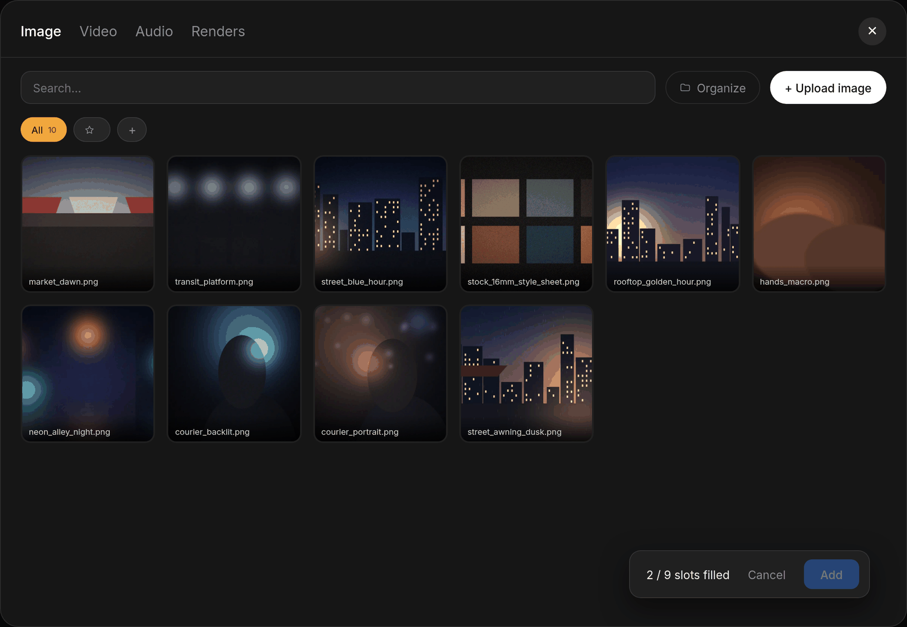

Picking a file attaches it *and* inserts its chip in the prompt in one step.
Typing `@` does the same thing from the keyboard: the menu matches attached
handles first, then everything in the input folder, and choosing a file that is
not attached yet attaches it.

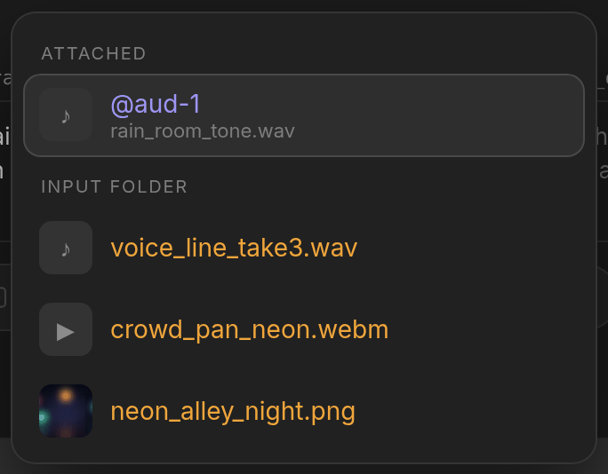

Each attached asset gets a colour, and its chip in the sentence wears the same
one, so a reference in the prose can be matched to a picture without reading.

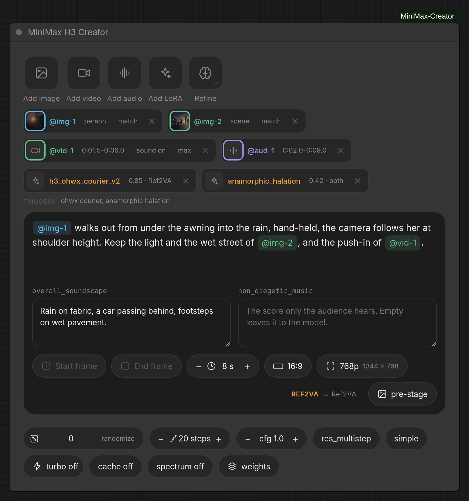

The row under the LoRA chips is every trigger word going in front of the prompt
at compile time, and the badge at the end of the pill row says where all of it
routes — four references here, so `REF2VA → Ref2VA`.

### What a reference actually gives up

A picture cited for one thing used to drag everything else in with it. Every
reference image chip has a scope dial — `full · person · object · scene · style`.
On `person`, "her from @img-1" stops pulling that image's background, palette and
pose into the video: the rewrite defines the subject as the person and retains
nothing else. It is a prose-level narrowing rather than an encode-level one,
because the DiT is handed the whole tensor either way and the prose is where H3's
own format expresses it.

Videos and audio get a segment editor instead, on the picker cell or on the
attached chip. Scrub, drag the in and out handles, or slide a fixed-length
selection along the clip. The range sits on the clip's waveform, decoded in the
browser, so you can see where the sound actually is before you cut it.

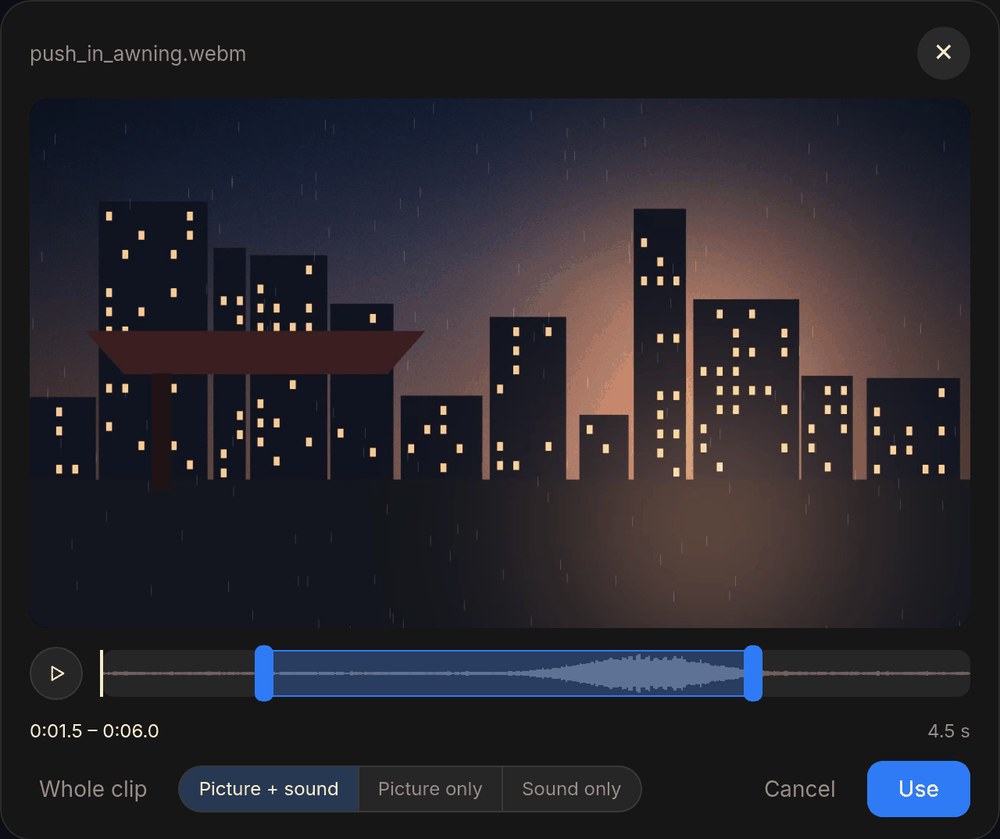

The three buttons under it are the other half of a video reference: **picture +
sound** binds the clip's own soundtrack as a reference audio alongside the
picture, **picture only** references it silently, and **sound only** throws the
picture away and turns the clip into an audio reference — which is what you want
for a voice, a room tone, or a piece of scoring that happens to live in an mp4.

## Refine

`Refine` in the rail rewrites your sentence into the expanded description H3 was
trained to read, using a small vision model and a per-mode template distilled
from MiniMax's own prompt-writing guides. The result lands in an editable box
under the prompt. Correct it, switch it off without losing it, or revert.

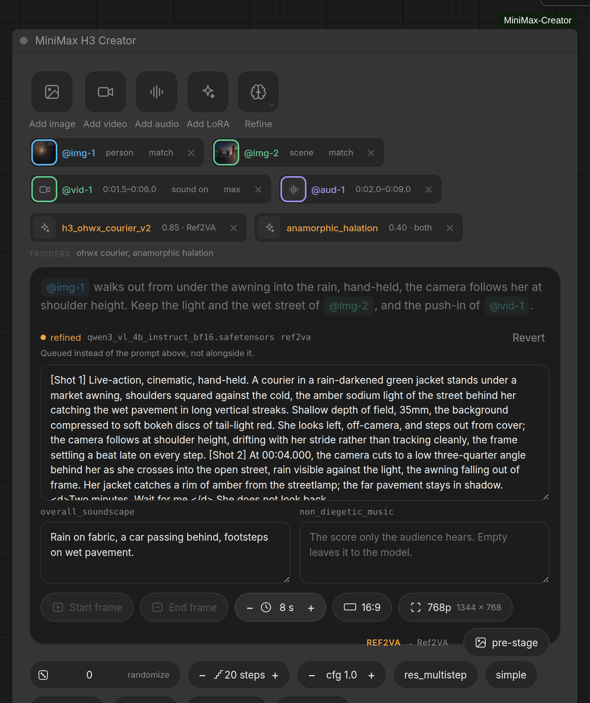

It is a button and not a queue-time step on purpose. What the DiT will actually
read has to be visible *before* five minutes of sampling, not inferable from the
result afterwards, and a rewrite generated inside `execute` would differ between
two runs of the same queue and miss ComfyUI's cache every time.

What it does:

- **Keeps everything you wrote and expands it.** A named style, medium, era,
  camera, lens or film stock is a hard constraint: it opens shot 1 by name and is
  then described in its actual visual signature, because the video model may not
  know the name. `shot on a small-frame camera` stays in the prose *and* gains
  the grain, depth of field and highlight rolloff that implies.
- **Looks at your images.** Start and end frames and reference images are sent to
  the model with the label each one will carry. Reference clips contribute a
  still. Audio cannot be heard, so say what is in it if it matters.
- **Writes the dialogue.** "She says something" is not something H3 can voice, so
  the refiner writes the actual line in the guide's `<d>` form, paced to finish
  inside the shot. Words you put in quotation marks are kept exactly, and the
  panel says so when a rewrite drops one.
- **Always writes the soundscape**, from the scene itself when you said nothing
  about sound. Music only when you ask for it — an empty `non_diegetic_music`
  leaves the choice to the model, which is different from the guide's `N/A`.
- **Leaves the format alone.** The instruction line, the `[Shot N]` markers, the
  written form of the cut times and the duration figure are computed from the
  real frame count by `contextir.py`. The model only writes prose.
- **Cuts the clip.** On the Creator node one card is one duration and nothing in
  it divides a clip, so the refiner is told how long the video runs and picks how
  many shots it holds and the second each one starts on. A timeline is not asked:
  its cards already *are* the shots.

The model is a Qwen3-VL text encoder in ComfyUI's own process, dropped in
`models/text_encoders/` and generated from through core's own text-generation
path. Nothing stays resident: the sampler evicts it when it needs the VRAM and it
comes back on the next press. That is the whole reason it runs here rather than
in a second runtime such as Ollama, which holds its own copy of the weights where
ComfyUI can neither see nor reclaim them. On a machine where H3's own encoder is
already offloading, that is the difference between a rewrite and a coffee break.
4B is plenty.

H3's own text encoder is *not* a candidate and is refused by name: it is
Qwen3-VL-32B truncated to 50 of its 64 layers with no final norm and no language
head, a conditioning tap with no way back to words.

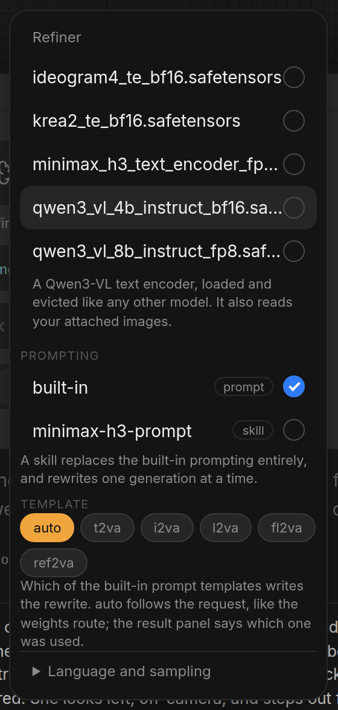

Which template writes the rewrite follows the request automatically — frames pick
I2VA / L2VA / FL2VA, `@` references pick REF2VA, a bare prompt picks T2VA — and
can be pinned here, exactly like the weights route. The result panel shows which
one was used and marks it `(pinned)` when it was not the automatic pick. A
`.skill` package can replace the built-in prompting entirely.

References survive editing, because a rewrite is stored with `@img-1` in it and
never with `<Picture 1>`: attaching another image re-labels it correctly instead
of leaving it pointing at the wrong tensor.

## Modes, checkpoints and the route

FL2VA and Ref2VA are **different checkpoints**. What you attach picks the mode,
and the mode picks which one is loaded — only that one, so a text-only render
never reads the reference weights off disk:

| attached | mode | checkpoint |
|---|---|---|
| nothing | T2VA | FL2VA |
| start and/or end frame | I2VA / L2VA / FL2VA | FL2VA |
| any reference image/video/audio | REF2VA | Ref2VA |

Frames and references cannot be combined — one pass, one checkpoint. The node
refuses rather than silently dropping one.

That table is the default, not a rule. **Route**, at the top of the weights
popover or on a click of the mode badge, forces every generation onto one
checkpoint whatever its mode derives. It is worth having because the two are one
architecture trained twice, and Ref2VA handles the text-only and keyframe
payloads perfectly well — so one checkpoint can cover a whole timeline instead of
loading both. Forcing FL2VA onto a generation that has references is still
refused, since reference blocks have nothing to attend to in those weights and
the result would be a quietly wrong video rather than an error.

The `MODE → checkpoint` label at the end of the pill row shows where a generation
ends up and cycles the route. The mode still decides how the request is
*encoded*; the route only decides which weights it runs on.

## LoRAs

The rail's fourth button opens a full-screen manager over `models/loras`. Cards
carry a showcase image or clip, the Civitai title, base model and trigger words,
all of it read from the CiviMeta sidecar directory beside each file. A LoRA
without one still gets a working card from its filename.

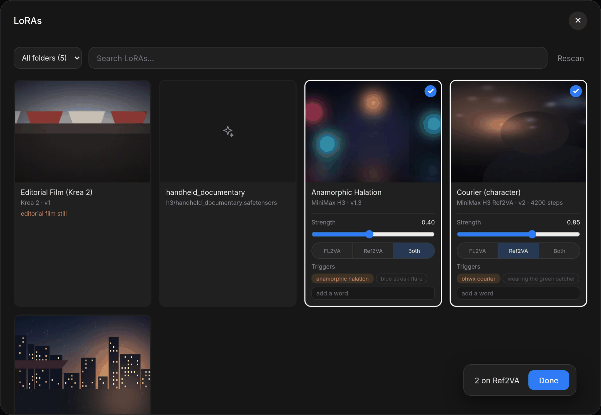

Each card sets a strength, which checkpoint the LoRA belongs to, and its trigger
words. Sidecar words arrive as chips you can switch off and a text field adds
your own, so a LoRA with a wrong sidecar is no harder to trigger than one with a
right one. The words are prefixed to the prompt at compile time and printed under
the LoRA chips in the node body — the prompt box does not show them, and a prompt
that is quietly not what it says is worse than a line of text.

Double-click a card for the detail sheet: the full sidecar, the showcase with its
generation recipes, and whatever the safetensors header itself can say when there
is no sidecar at all.

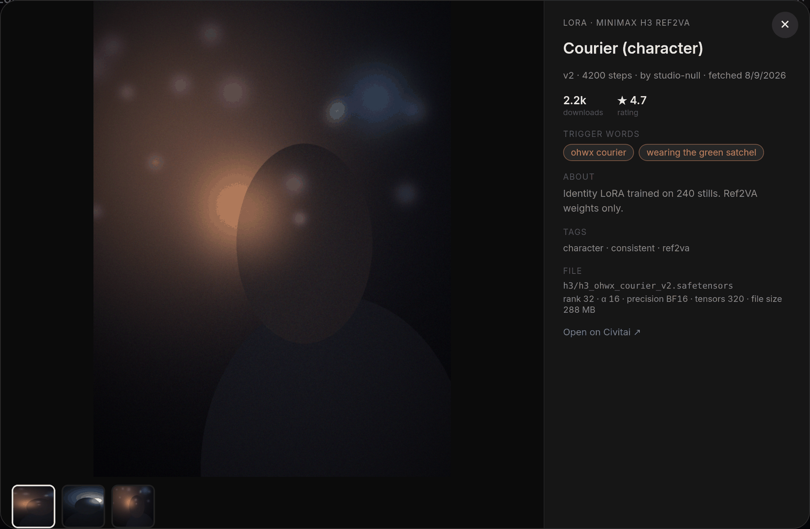

### Turbo

The sampler row carries a turbo switch. It engages one of the H3 distillation
LoRAs — larryvrh's `minimax_h3_turbo_v4_step600_ema`, the lightx2v 4-step
distill, or Kijai's conversions of it — and it is a switch rather than a preset
because everything it does is undone by switching it off. On, it adds the file to
the ordinary LoRA stack at a strength guessed from the filename, saves the
sampler row and re-sets it to euler + beta (H3 samples picture and sound as one
latent, and at turbo step counts `res_multistep` leaves the soundtrack
warbling), and drops the steps to draft 4 / med 6 / good 8. Off puts all of it
back. Merged turbo checkpoints engage with no LoRA at all.

## The Timeline

A second node for a clip made of several shots. Each card is a whole generation —
its own prompt, `@` references and LoRAs, edited in the same editor the Creator
node uses, because a segment *is* a generation and there is no reduced segment UI
to keep in step.


The lane in the node body is strictly proportional to the durations. The strip
inside the modal is where the work happens.


A toggle on the bar decides what becomes of the cards.

**Chained** generates each segment separately and concatenates the results. A
segment can start from the previous one's decoded last frame, and its sound can
inherit a short tail of the previous one's. There is no limit on the finished
length.

**One pass** compiles the same cards into a *single* generation. H3's prompt
format is already a shot list, so the segments become its shots:

```
integrated_multimodal_description: [Shot 1] Live-action, cinematic, a courier
waits under an awning [Shot 2] At 00:05.000, the camera cuts to a close-up of
her hands [Shot 3] At 00:09.000, the shot transitions to the empty street
```

Cut times come from the card durations; the prose after the comma is yours,
including which of the guide's five transition phrasings you wanted. Nothing is
decoded and re-encoded mid-clip, so there is no seam: no duplicated frame at the
join, no colour drift, and dialogue or a music bed can carry across a cut.

What one pass has only one of is resolved when the cards are merged:

| | |
|---|---|
| references | merged by file across shots — the same face cited in shot 1 and shot 4 is one `<Picture N>`. Per-segment handles are rewritten onto the merged pool first. |
| keyframes | a start frame belongs to shot 1 and an end frame to the last shot; anywhere else is refused. |
| LoRAs | one stack, folded global-first, with a segment's own replacing a global entry of the same name |
| checkpoint, soundscape, music | taken from whichever shots set them, and refused if two disagree |
| seed | one, rather than `seed + k` per segment |
| seams | there are none; carried-over `continue` flags are ignored, so you can toggle back and forth without editing JSON |

**Refine all** on the bar rewrites every card in one call, which is the only way
a later shot keeps the look, the people and the light an earlier one established.
Each card can also be refined on its own from inside it.

## The PreStage

The pipeline eats stills — start frames, end frames, references, style sheets —
and making one is a whole second workflow: another tab, another set of loaders,
a render, then a trip through the output folder to find the file again. The
PreStage puts it on the same canvas as the video it is for, generating locally
with Krea 2 or Ideogram 4.0 (both open weights, both native in core). You never
leave the workflow you are already in.

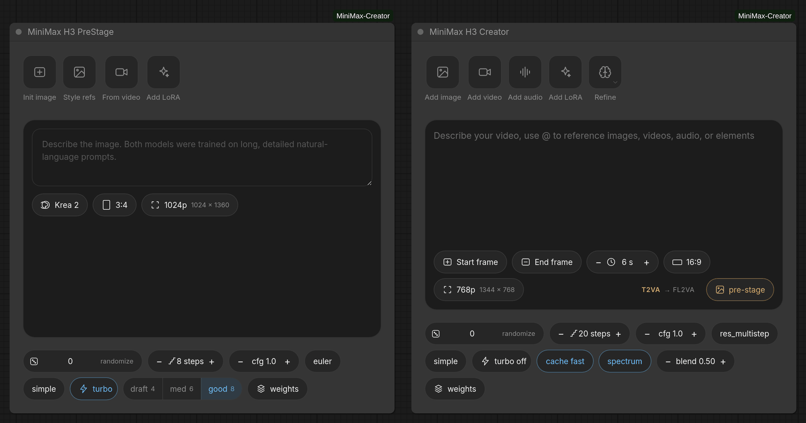

It is spawned by the **pre-stage** pill on the Creator or Timeline rather than
hunted for in the node menu, and it sits at that node's left edge, so the desk
reads *still ← pre-stage · creator → video*. Its result card floats on its own
left, with chips that write the finished still straight into the peer's blob as a
start frame, an end frame or a reference. The hand-off is by file, so there is no
execution edge to get wrong: one Queue runs both, and an untouched PreStage is a
cache hit.

Krea 2 takes up to three style references through core's Qwen-edit encoder.
Ideogram has no reference conditioning at all, so attaching one and switching to
it is refused with a message rather than silently ignored. **From video** grabs a
frame out of any clip in the input folder, client-side, using the trim editor's
own scrubbing.

## The preview and the render

While it samples, the node shows the sampler's own preview beside itself — the
card at the top of this page, with the step count and the clock over the picture
rather than in a caption row the picture could have had. It looks like a second
node and is nothing of the sort: it is a DOM element that re-derives its position
from the node's every frame, so it pans, zooms and drags with the graph without
ever being in it. Nothing about it serializes, and it does not exist until there
is a picture.

With KJNodes installed and a decoder picked, that preview is decoded through
`taeh3` and looks like the video. Without either it falls back to core's
latent2rgb, which is colour without detail. The generation is identical either
way.

When it finishes, the same card plays the clip, muxed at 24 fps and written to
`output/minimax/`. Both are wired by node id rather than by a socket, which is
what makes it work inside an expanded subgraph.

## Duration and canvas

Frame counts must satisfy `n % 17 == 5` at 24 fps, so there is no 6.00-second H3
video. The pill shows whole seconds and the compiler lands on the nearest legal
count; downstream always sees the true duration, because the prompt refiner
writes its shot timeline to fit it.

| shown | 5 | 6 | 7 | 8 | 9 | 10 | 12 | 15 |
|---|---|---|---|---|---|---|---|---|
| frames | 124 | 141 | 175 | 192 | 209 | 243 | 294 | 362 |
| real | 5.17 | 5.88 | 7.29 | 8.00 | 8.71 | 10.13 | 12.25 | 15.08 |

The resolution slider sets the **short edge** (384–896, native 768). The 768×1344
area cap scales as its square, so the constraint keeps its shape and `768`
reproduces core's 1344×768 exactly. Both axes snap to 32.

In the image modes the aspect comes from the keyframe, matching the hosted API's
"adaptive" behaviour; the slider still owns the scale. The **first frame wins**
when both are set — the encoder treats it as the geometry anchor and cover-crops
the last frame onto the canvas it defines. Aspects outside H3's 21:9–9:16
envelope are clamped, not stretched.

## Under the hood

**No sockets.** The weights are named in the blob and `models.py` emits the
loaders inside the subgraph the node already builds. The node samples, saves and
plays the result itself, which is why it has no outputs either. A node that
samples cannot be an ordinary node — ComfyUI has no way to express "and then
sample" except by returning a subgraph — so `execute` compiles the blob to one
payload, hands it to `render.emit`, and returns that through `expand`. A Creator
render is exactly a one-segment timeline: same payload shape, same emitted graph,
one code path.

**The label ordering contract.** `compile.plan_references()` produces one ordered
walk — images, then videos with each soundtrack's step *before* its video, then
standalone audio — and both the `<Picture N>` numbering and the DiT payload are
built from that single list. A mismatch here would be silent: the prompt would
name `<Picture 3>` while the payload held a different tensor there, and you would
get a slightly wrong video with no error. One list, two consumers, so they cannot
drift.

**The frontend** lives in `js/minimax_creator/`, and `js/minimax_creator.js` is
the only file with import side effects. The prompt box is contenteditable rather
than a textarea because an `@` reference has to be one atomic thing you can
delete in a single keystroke; its DOM is kept flat by handling Enter and paste
directly, so reading the value back is a one-level walk that round-trips exactly
with the `@handle` text `compile.py` parses. `canvas.js` duplicating `canvas.py`
is deliberate — the pill has to show `1344 × 768` before anything is queued — but
`canvas.py` is authoritative and a change to one belongs in the other. There is a
test for that.

The blob formats are documented in [docs/creator_data.md](docs/creator_data.md).
The reasoning behind all of it, decision by decision, is in
[PLAN.md](PLAN.md).

## Tests

```
python3 tests/test_compile.py         # the compiler: canvas math, modes, limits, ordering
python3 tests/test_refine.py          # the boundary between an LLM's reply and a prompt
python3 tests/test_canvas_mirror.py   # canvas.js against canvas.py, 60 durations x 30 canvases
python3 tests/test_prestage_mirror.py # state.js against compile_image.py
python3 tests/test_accel.py
python3 tests/test_refine_skill.py
```

No torch and no ComfyUI: `canvas.py`, `compile.py` and `refine.py` are
deliberately free of both. The graph tests (`test_creator_graph.py`,
`test_timeline_graph.py`, `test_prestage_graph.py`, `test_media_window.py`,
`test_ref_video_size.py`) do need ComfyUI importable and skip themselves with a
message when it is not:

```
COMFYUI_PATH=~/ComfyUI <comfy-venv>/bin/python3 tests/test_creator_graph.py
```

`COMFYUI_PATH` is the tree to import from and defaults to `~/ComfyUI`. Set
`COMFYUI_BASE` as well when `--base-directory` is somewhere else — on a Desktop
install the running tree and the folder holding `custom_nodes`, `models` and
`output` are usually two different places. Run them with the interpreter that
ComfyUI itself uses, since they import torch through it. The pack is imported
under whatever name this checkout's directory has, so a clone named per the
install instructions above needs nothing configured.

## License

[MIT](LICENSE). ComfyUI itself is GPL-3.0 and this pack imports it; if you
redistribute the two together rather than as a node pack people install
themselves, that combination is what the GPL has an opinion about.

---

*The screenshots are this pack running in ComfyUI. The media in them is
placeholder footage generated on the spot, and the model files are stand-ins, so
the pickers have something to list — including the half-denoised frame on the
preview card, which was painted rather than decoded off a GPU.*
